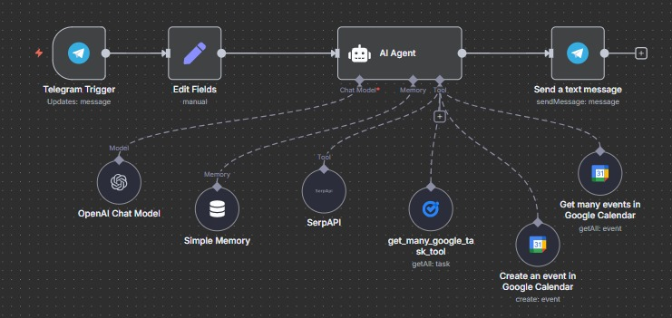

# Telegram AI Agent using N8N
An AI-powered Telegram assistant built with n8n, integrating OpenAI, SerpAPI, Google Calendar, and Google Tasks. It enables natural language chat, task management, event scheduling, and web search all from Telegram AI Agent chat. The modular workflow is easy to customize and extend.

## Features
- **Telegram Integration** – Talk to your AI agent through Telegram  
- **OpenAI Chat Model with Memory** – Context-aware, natural conversations  
- **SerpAPI Search** – Get real-time web search results  
- **Google Calendar** – Create and fetch events with natural language  
- **Google Tasks** – Manage and list tasks directly via chat

## Demo

## Tech Stack
- [n8n](https://n8n.io) – Automation & workflow engine  
- [Telegram Bot API](https://core.telegram.org/bots/api) – Chat interface  
- [OpenAI](https://platform.openai.com/) – AI-powered conversation  
- [SerpAPI](https://serpapi.com/) – Web search integration  
- [Google Calendar API](https://developers.google.com/calendar) – Event management  
- [Google Tasks API](https://developers.google.com/tasks) – Task management

